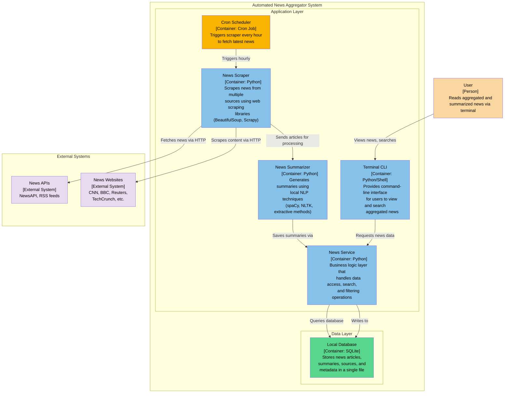

# labs-information-security

As a student of AUCA University, I am familiar with
all the terms and conditions in the syllabus. And I take
full responsibility for the deadlines set.

# Final Project
1. Automated News Aggregator
2. CI/CD with Gitlab

Automated News Aggregator Container Diagram

